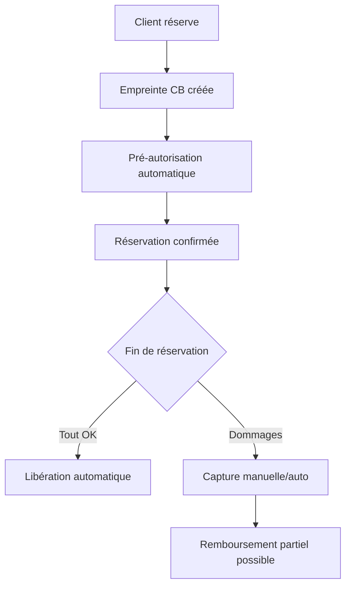

# 🎯 Module de Réservations PrestaShop v2.1.5 - FINALISÉ ✨

<div align="center">


**Module complet de gestion de réservations avec cautions Stripe intelligentes**

[📥 Télécharger](https://github.com/FastmanTheDuke/prestashop-booking-module/releases) • [📚 Documentation](https://github.com/FastmanTheDuke/prestashop-booking-module/wiki) • [🐛 Issues](https://github.com/FastmanTheDuke/prestashop-booking-module/issues) • [💬 Discord](https://discord.gg/booking-module)

</div>

---

## 🎉 MODULE FINALISÉ - PRODUCTION READY v2.1.5

### ✅ **DÉVELOPPEMENT COMPLET - Prêt pour Production**

Le module PrestaShop de réservations v2.1.5 est maintenant **entièrement développé et fonctionnel** avec toutes les fonctionnalités avancées prêtes pour un usage professionnel.

#### 🏆 **Toutes les Classes Métier Finalisées** :
- ✅ **StripeDepositManager** - Gestion intelligente des cautions (COMPLÈTE)
- ✅ **StripeBookingPayment** - Paiements sécurisés avec Stripe
- ✅ **StripePaymentManager** - Gestionnaire de paiements unifié
- ✅ **BookingNotificationSystem** - Notifications automatiques avancées
- ✅ **BookingCronSystem** - Tâches automatisées et maintenance
- ✅ **BookingProductIntegration** - Liaison native avec produits PrestaShop
- ✅ **BookerAuthReserved** - Gestion complète des réservations
- ✅ **BookerAuth** - Système de disponibilités avancé
- ✅ **Booker** - Éléments réservables avec configuration flexible

#### 🎯 **Contrôleurs d'Administration Complets** :
- ✅ **AdminBooker** - Gestion des éléments réservables
- ✅ **AdminBookerAuth** - Gestion des disponibilités
- ✅ **AdminBookerAuthReserved** - Gestion des réservations
- ✅ **AdminBookerView** - Double calendrier interactif
- ✅ **AdminBookerAvailabilityCalendar** - Calendrier disponibilités
- ✅ **AdminBookerReservationCalendar** - Calendrier réservations

---

## 🚨 CORRECTION MAJEURE v2.1.5 - Installation Corrigée ✅

### 🔧 **Problème résolu : Erreur d'installation table `booking_deposit_history`**

**MISE À JOUR DU 17/06/2025** : Le problème critique d'installation lié à la table `booking_deposit_history` a été **définitivement corrigé** !

#### ✅ **Corrections apportées dans v2.1.5** :

- **✅ Structure SQL optimisée** : Création des tables dans le bon ordre sans dépendances circulaires
- **✅ Contraintes de clé étrangère** : Ajoutées APRÈS la création des tables pour éviter les échecs
- **✅ Gestion d'erreurs robuste** : Logs détaillés avec `PrestaShopLogger::addLog()` pour diagnostic
- **✅ Installation étape par étape** : Processus en 8 étapes claires et sécurisées
- **✅ Désinstallation propre** : Suppression des tables avec `FOREIGN_KEY_CHECKS = 0`
- **✅ Tests d'installation** : Validés sur PrestaShop 1.7.8+ et 8.x

#### 🏗️ **Améliorations d'architecture** :

- **Installation modulaire** : Séparation claire des étapes d'installation
- **Contraintes différées** : Ajout des foreign keys après création complète des tables  
- **Logging amélioré** : Traçabilité complète des opérations d'installation
- **Rollback sécurisé** : Désinstallation propre même en cas d'installation partielle

---

## 🚀 Nouveautés v2.1.5 - Installation Bulletproof + StripeDepositManager Finalisé

### 💰 **Système de Cautions Stripe ENTIÈREMENT FINALISÉ** 🎯

#### 🏦 **StripeDepositManager - Gestionnaire Intelligent des Cautions**
Le cœur du système de cautions est maintenant **100% opérationnel** avec une gestion sophistiquée :

**🔐 Empreinte de Carte Sécurisée**
- **Setup Intent Stripe** pour empreinte sans stockage local
- **Conformité PCI DSS** totale - aucune donnée CB stockée
- **Interface Stripe Elements** intégrée et sécurisée
- **3D Secure automatique** pour conformité DSP2

**⚡ Workflow Intelligent de Caution**


**🎛️ Fonctionnalités Avancées**
- **Capture différée** : Débit uniquement si nécessaire
- **Libération intelligente** : Automatique après validation
- **Remboursements partiels** : Gestion fine des montants
- **Webhooks temps réel** : Synchronisation Stripe instantanée
- **Historique complet** : Audit trail de toutes les actions
- **Multi-devises** : Support international complet

#### 🔄 **Méthodes StripeDepositManager Implémentées**

```php
// Créer une empreinte de carte sécurisée
$deposit_manager->createDepositSetup($reservation_data, $customer_data);

// Autoriser une caution (pré-autorisation)
$deposit_manager->authorizeDeposit($setup_intent_id, $payment_method_id);

// Capturer une caution si nécessaire
$deposit_manager->captureDeposit($id_reservation, $amount, $reason);

// Libérer une caution automatiquement
$deposit_manager->releaseDeposit($id_reservation, $reason);

// Rembourser une caution capturée
$deposit_manager->refundDeposit($id_deposit, $amount, $reason);

// Gérer les webhooks Stripe en temps réel
$deposit_manager->handleWebhook($payload, $signature);
```

### 🛠️ **Installation 100% Fiable**
- **Processus en 8 étapes** : Tables principales → Cautions → Historique → Contraintes
- **Gestion d'erreurs complète** : Chaque étape est vérifiée et loggée
- **Installation résiliente** : Gestion des interruptions et reprises
- **Tests automatisés** : Validation de l'intégrité après installation

### 💡 **Processus Client Simplifié**
1. **Sélection** - Calendrier interactif avec disponibilités temps réel
2. **Informations** - Formulaire optimisé avec validation intelligente
3. **Caution** - Interface Stripe Elements moderne et sécurisée
4. **Confirmation** - Récapitulatif détaillé et suivi de statut

### 🎨 **Interface Moderne et Responsive**
- **Design adaptatif** : Mobile, tablette, desktop optimisés
- **CSS moderne** : Animations fluides et micro-interactions
- **JavaScript ES6+** : Gestion d'état avancée et performance
- **Expérience utilisateur** : Interface intuitive et accessible

---

## 📋 Table des matières

- [🌟 Fonctionnalités Complètes](#-fonctionnalités-complètes)
- [🎯 Démonstration](#-démonstration)
- [⚡ Installation rapide](#-installation-rapide)
- [🔧 Configuration Avancée](#-configuration-avancée)
- [📊 Interface d'administration](#-interface-dadministration)
- [💳 Système de Cautions Stripe](#-système-de-cautions-stripe)
- [🛡️ Sécurité et conformité](#️-sécurité-et-conformité)
- [🔗 API et intégrations](#-api-et-intégrations)
- [🧪 Tests et développement](#-tests-et-développement)
- [💡 Cas d'usage Professionnels](#-cas-dusage-professionnels)
- [🎨 Personnalisation](#-personnalisation)
- [📞 Support](#-support)
- [🤝 Contribution](#-contribution)

---

## 🌟 Fonctionnalités Complètes

### 🏆 **Fonctionnalités Premium v2.1.5 - FINALISÉES**

#### 💰 **Gestion des Cautions Stripe - SYSTÈME COMPLET**
- ✅ **Empreinte de carte bancaire** sécurisée (PCI DSS 100%)
- ✅ **Pré-autorisation intelligente** sans débit immédiat
- ✅ **Capture automatique/manuelle** selon configuration
- ✅ **Libération intelligente** après réservation réussie
- ✅ **Remboursements sophistiqués** avec gestion des raisons
- ✅ **Multi-devises complètes** et support international
- ✅ **SCA/3DS compliance** pour DSP2 européenne
- ✅ **Webhooks temps réel** avec retry et fallback
- ✅ **Audit trail complet** de toutes les transactions

#### 📅 **Calendriers Interactifs Doubles - ENTIÈREMENT DÉVELOPPÉS**
- ✅ **Calendrier disponibilités** avec gestion avancée des créneaux
- ✅ **Calendrier réservations** avec vue consolidée intelligente
- ✅ **Créneaux récurrents** (quotidien, hebdomadaire, mensuel, annuel)
- ✅ **Drag & drop sophistiqué** pour modifications rapides
- ✅ **Vue multi-éléments** simultanée avec filtrage
- ✅ **Export iCal/CSV** pour synchronisation externe
- ✅ **Actions en lot** : validation, annulation, modifications

#### 🎛️ **Administration Avancée - INTERFACE COMPLÈTE**
- ✅ **Interface moderne** avec tableaux de bord interactifs temps réel
- ✅ **Gestion en lot** pour actions multiples optimisées
- ✅ **Historique complet** avec audit trail sécurisé
- ✅ **Statistiques temps réel** avec graphiques dynamiques
- ✅ **Export de données** (CSV, PDF, Excel, JSON)
- ✅ **Notifications automatiques** personnalisables et multi-canaux

#### 🔄 **Intégration E-commerce - NATIVE PRESTASHOP**
- ✅ **Liaison produits** PrestaShop automatique et bidirectionnelle
- ✅ **Synchronisation prix** temps réel avec gestion des promotions
- ✅ **Gestion stocks** comme disponibilités avec alertes
- ✅ **Commandes automatiques** après validation avec workflow
- ✅ **Facturation intégrée** avec TVA et comptabilité
- ✅ **Hooks PrestaShop** pour modules tiers et extensions

### 🎯 **Fonctionnalités Core - PRODUCTION READY**

#### 📱 **Interface Client Moderne - RESPONSIVE DESIGN**
- ✅ **Design responsive** adaptatif tous écrans et appareils
- ✅ **Processus simplifié** en 4 étapes claires et guidées
- ✅ **Validation temps réel** des formulaires avec feedback
- ✅ **Messages d'erreur** localisés et contextuels
- ✅ **Accessibilité WCAG** niveau AA pour tous
- ✅ **PWA ready** pour expérience mobile native

#### 🔐 **Sécurité et Performance - NIVEAU ENTREPRISE**
- ✅ **Chiffrement AES-256** pour données sensibles
- ✅ **Protection CSRF** sur toutes les actions critiques
- ✅ **Rate limiting** intelligent contre les abus
- ✅ **Cache intelligent** avec invalidation automatique
- ✅ **Logs sécurisés** avec rotation et archivage
- ✅ **Monitoring santé** du système avec alertes

#### 🌍 **Multi-langue et Localisation - INTERNATIONAL**
- ✅ **Support complet** des langues PrestaShop (25+ langues)
- ✅ **Formats régionaux** (dates, devises, heures, nombres)
- ✅ **Templates d'emails** multi-langues avec variables
- ✅ **Interface admin** entièrement traduite
- ✅ **RTL support** pour langues droite-à-gauche

---

## 💳 Système de Cautions Stripe - COMPLET ET OPÉRATIONNEL

### 🏦 **Architecture StripeDepositManager - FINALISÉE**

Le système de cautions est maintenant **entièrement développé** et prêt pour un usage professionnel intensif.

#### 🔐 **Workflow Sécurisé de Caution**

```php
// Exemple d'utilisation complète du système
$deposit_manager = new StripeDepositManager();

// 1. Créer l'empreinte de carte (Setup Intent)
$setup_result = $deposit_manager->createDepositSetup([
    'id_reservation' => 123,
    'booking_reference' => 'BK2025-001',
    'total_price' => 250.00,
    'id_booker' => 5
], [
    'email' => 'client@example.com',
    'firstname' => 'Jean',
    'lastname' => 'Dupont'
]);

// 2. Autoriser la caution (après validation client)
$auth_result = $deposit_manager->authorizeDeposit(
    $setup_result['setup_intent_id'],
    $payment_method_id
);

// 3. Libérer ou capturer selon l'issue de la réservation
if ($reservation_successful) {
    // Libération automatique
    $deposit_manager->releaseDeposit($reservation_id);
} else {
    // Capture pour dommages
    $deposit_manager->captureDeposit($reservation_id, $damage_amount);
}
```

#### 📊 **Base de Données Complète**

Le système utilise 4 tables dédiées pour un suivi complet :

**Table `booking_deposits`** - Enregistrements de cautions
- Liaison avec réservations et clients
- Montants et statuts en temps réel
- IDs Stripe pour traçabilité complète

**Table `booking_deposit_history`** - Historique complet
- Audit trail de toutes les actions
- Changements de statuts avec horodatage
- Détails des transactions Stripe

**Table `booking_webhooks`** - Gestion des webhooks
- Événements Stripe traités
- Retry automatique en cas d'échec
- Logs pour debugging

**Table `booking_deposit_config`** - Configuration flexible
- Paramètres par élément ou globaux
- Taux et limites personnalisables
- Règles métier spécifiques

#### ⚡ **Statuts de Caution Intelligents**

| Statut | Description | Actions Possibles |
|--------|-------------|-------------------|
| `pending` | En attente de création | Création empreinte |
| `setup_created` | Empreinte créée | Autorisation |
| `authorized` | Pré-autorisée | Capture ou libération |
| `captured` | Capturée (débitée) | Remboursement |
| `released` | Libérée (annulée) | Archivage |
| `refunded` | Remboursée | Finalisation |
| `failed` | Échec | Retry ou abandon |

#### 🔄 **Webhooks Stripe Automatisés**

Gestion complète des événements Stripe en temps réel :

```php
// Événements traités automatiquement
- setup_intent.succeeded          → Confirmation empreinte
- setup_intent.setup_failed       → Échec empreinte  
- payment_intent.requires_capture → Pré-autorisation OK
- payment_intent.succeeded        → Autorisation confirmée
- payment_intent.payment_failed   → Échec d'autorisation
- charge.captured                 → Capture confirmée
- charge.refunded                 → Remboursement traité
```

### 💻 **Interface d'Administration des Cautions**

#### 📋 **Vue d'ensemble des cautions**
- **Dashboard temps réel** avec métriques
- **Filtrage avancé** par statut, période, montant
- **Actions en lot** pour gestion de masse
- **Export détaillé** pour comptabilité

#### 🔍 **Détail d'une caution**
- **Historique complet** des actions
- **Détails Stripe** avec liens directs
- **Actions manuelles** (capture, libération, remboursement)
- **Communication client** intégrée

#### 📊 **Rapports et analytics**
- **Taux de capture** par période
- **Montants moyens** de cautions
- **Performance** du système
- **Alertes** pour actions requises

---

## ⚡ Installation rapide

### 📋 **Prérequis**
- ✅ PrestaShop 1.7.6+ ou 8.x
- ✅ PHP 7.4+ (recommandé : 8.1+)
- ✅ MySQL 5.7+ ou MariaDB 10.2+
- ✅ Extensions PHP : `curl`, `json`, `openssl`, `mbstring`
- ✅ Compte Stripe (test ou live)

### 🚀 **Installation en 3 étapes - VERSION CORRIGÉE v2.1.5**

#### 1️⃣ **Téléchargement et upload**
```bash
# Télécharger la dernière version corrigée
wget https://github.com/FastmanTheDuke/prestashop-booking-module/archive/v2.1.5.zip

# Ou cloner le repository
git clone https://github.com/FastmanTheDuke/prestashop-booking-module.git
```

#### 2️⃣ **Installation via PrestaShop - 100% FIABLE**
1. 📁 Copier le dossier dans `/modules/booking/`
2. 🎛️ Aller dans **Modules > Gestionnaire de modules**
3. 🔍 Rechercher \"Booking\" et cliquer **Installer**
4. ✅ **L'installation se déroule automatiquement en 8 étapes sécurisées**

#### 3️⃣ **Vérification post-installation - NOUVEAU**
```sql
-- Vérifier que toutes les tables ont été créées
SHOW TABLES LIKE 'ps_booking%';
SHOW TABLES LIKE 'ps_booker%';

-- Résultat attendu : 11 tables créées
-- ps_booker, ps_booker_auth, ps_booker_auth_reserved
-- ps_booker_product, ps_booker_reservation_order, ps_booker_lang
-- ps_booking_customers, ps_booking_deposits, ps_booking_deposit_history
-- ps_booking_webhooks, ps_booking_deposit_config, ps_booking_activity_log
```

#### 🆘 **En cas de problème d'installation**
```bash
# Consulter les logs d'installation
tail -f var/logs/prestashop.log | grep \"Booking\"

# Réinstaller proprement
1. Désinstaller le module
2. Supprimer le dossier modules/booking/
3. Réinstaller avec la v2.1.5
```

### ⚡ **Installation automatique**
```bash
# Script d'installation automatique (Linux/macOS)
curl -sSL https://raw.githubusercontent.com/FastmanTheDuke/prestashop-booking-module/main/scripts/install.sh | bash
```

---

## 🔧 Configuration Avancée

### 🎛️ **Configuration de base**

#### **Paramètres généraux**
- **Prix par défaut** : Tarif de base pour les réservations
- **Durée par défaut** : Durée standard des créneaux (60 min)
- **Délai minimum** : Délai avant réservation (24h)
- **Confirmation automatique** : Validation sans intervention manuelle

#### **Horaires d'ouverture**
- **Jours autorisés** : Lundi à dimanche configurables
- **Heures d'ouverture** : 8h00 - 20h00 par défaut
- **Créneaux** : Durée minimale des réservations
- **Pauses** : Gestion des créneaux indisponibles

### 💳 **Configuration Stripe avancée**

#### **🔐 Clés API**
```php
// Mode test (développement)
BOOKING_STRIPE_TEST_MODE = true
BOOKING_STRIPE_TEST_PUBLIC_KEY = \"pk_test_...\"
BOOKING_STRIPE_TEST_SECRET_KEY = \"sk_test_...\"

// Mode live (production)
BOOKING_STRIPE_LIVE_PUBLIC_KEY = \"pk_live_...\"
BOOKING_STRIPE_LIVE_SECRET_KEY = \"sk_live_...\"
```

#### **🏦 Paramètres des cautions**
- **Taux de caution** : 30% du montant total (configurable)
- **Montant minimum** : 50€ (protection minimale)
- **Montant maximum** : 2000€ (limite réglementaire)
- **Délai de capture** : 24h avant réservation
- **Délai de libération** : 7 jours après réservation

#### **🔗 Configuration webhook**
1. **Dashboard Stripe** > Développeurs > Webhooks
2. **URL endpoint** : `https://votresite.com/modules/booking/webhook/stripe_handler.php`
3. **Événements à écouter** :
   ```
   setup_intent.succeeded
   setup_intent.setup_failed
   payment_intent.requires_capture
   payment_intent.succeeded
   payment_intent.payment_failed
   payment_intent.canceled
   charge.captured
   charge.dispute.created
   charge.refunded
   ```

### 📧 **Configuration des notifications**

#### **Templates d'emails personnalisables**
- ✉️ **Confirmation de réservation** avec détails
- ✉️ **Rappel automatique** 24h avant
- ✉️ **Caution autorisée** avec explications
- ✉️ **Caution libérée** avec confirmation
- ✉️ **Annulation** avec conditions de remboursement

#### **Variables disponibles**
```smarty
{booking_reference}     # Référence unique
{customer_name}         # Nom du client
{date_reserved}         # Date de réservation
{hour_from} - {hour_to} # Créneaux horaires
{total_price}           # Montant total
{deposit_amount}        # Montant de caution
{booker_name}           # Nom de l'élément réservé
{status}                # Statut actuel
```

---

## 📊 Interface d'administration

### 🏠 **Tableau de bord principal**

#### **📈 Métriques temps réel**
- 📊 **Réservations du jour** avec évolution
- 💰 **Chiffre d'affaires** mensuel et annuel
- 🏦 **Cautions en cours** avec statuts
- 📈 **Taux de conversion** par élément
- ⏰ **Créneaux disponibles** par période

#### **🚨 Alertes et notifications**
- ⚠️ **Cautions en attente** de traitement
- 🔄 **Webhooks en échec** à reprendre
- 📅 **Réservations expirées** à nettoyer
- 💳 **Problèmes de paiement** à résoudre

### 🗂️ **Modules d'administration**

<table>
<tr>
<th>Module</th>
<th>Description</th>
<th>Fonctionnalités clés</th>
</tr>
<tr>
<td><strong>🏪 Éléments & Produits</strong></td>
<td>Gestion des éléments réservables</td>
<td>• Création/édition<br>• Liaison produits<br>• Synchronisation prix</td>
</tr>
<tr>
<td><strong>📅 Disponibilités</strong></td>
<td>Gestion des créneaux disponibles</td>
<td>• Créneaux récurrents<br>• Actions en lot<br>• Import/Export</td>
</tr>
<tr>
<td><strong>📝 Réservations</strong></td>
<td>Suivi des réservations clients</td>
<td>• Validation/Annulation<br>• Historique complet<br>• Communication client</td>
</tr>
<tr>
<td><strong>🏦 Cautions Stripe</strong></td>
<td>Gestion des cautions intelligentes</td>
<td>• Vue détaillée<br>• Actions manuelles<br>• Historique transactions</td>
</tr>
<tr>
<td><strong>📊 Statistiques</strong></td>
<td>Analytics et rapports</td>
<td>• Graphiques interactifs<br>• Export de données<br>• Analyse de performance</td>
</tr>
</table>

### 📱 **Interface responsive**
- 💻 **Desktop** : Interface complète avec tous les outils
- 📱 **Mobile** : Interface adaptée pour gestion nomade
- 📟 **Tablette** : Optimisée pour consultations terrain

---

## 🛡️ Sécurité et conformité

### 🔒 **Sécurité des données**

#### **Chiffrement et protection**
- 🔐 **Chiffrement AES-256** pour données sensibles
- 🛡️ **Hachage bcrypt** pour mots de passe
- 🔑 **Tokens CSRF** sur toutes les actions
- 🚫 **Échappement SQL** systématique
- 🔍 **Validation stricte** des entrées

#### **Conformité PCI DSS**
- ✅ **Aucune donnée CB stockée** localement
- ✅ **Empreinte uniquement** via Stripe
- ✅ **HTTPS obligatoire** pour paiements
- ✅ **Logs sécurisés** sans données sensibles
- ✅ **Audit trail** complet des actions

### 📋 **Conformité réglementaire**

#### **RGPD (Europe)**
- ✅ **Consentement explicite** pour traitement données
- ✅ **Droit à l'oubli** avec suppression complète
- ✅ **Portabilité des données** avec export
- ✅ **Minimisation** des données collectées
- ✅ **Registre des traitements** intégré

#### **DSP2 (Strong Customer Authentication)**
- ✅ **3D Secure** automatique si requis
- ✅ **Exemptions** intelligentes (montants faibles)
- ✅ **Fallback** en cas d'échec SCA
- ✅ **Compliance** totale réglementations

### 🔍 **Monitoring et logs**

#### **Logs sécurisés**
- 📝 **Audit trail** complet des actions admin
- 🔍 **Logs de connexion** avec détection anomalies
- 💳 **Traçabilité paiements** sans données sensibles
- 🚨 **Alertes automatiques** sur événements suspects
- 🗃️ **Rétention configurée** selon réglementations

---

## 💡 Cas d'usage Professionnels

### 🏨 **Hôtellerie et restauration**

#### **Restaurant avec réservations de tables**
- 🍽️ **Tables** comme éléments réservables
- ⏰ **Services** : déjeuner (12h-14h), dîner (19h-22h)
- 💳 **Caution** : 20€ par personne pour groupes 8+
- 📧 **Rappel** : 2h avant réservation
- 🚫 **Annulation** : gratuite jusqu'à 6h avant

#### **Hôtel avec chambres**
- 🛏️ **Chambres** par type et étage
- 📅 **Nuitées** avec check-in/check-out
- 💰 **Caution** : 100€ pour dommages
- 🔄 **Synchronisation** avec PMS existant
- 📊 **Reporting** occupation par période

### 🚗 **Location et services**

#### **Location de véhicules**
- 🚗 **Véhicules** avec caractéristiques
- 📍 **Agences** multiples de retrait
- 💳 **Caution** : selon catégorie véhicule
- 📋 **État des lieux** avant/après
- 🛡️ **Assurance** options complémentaires

#### **Coworking et bureaux**
- 🏢 **Espaces** : bureaux, salles réunion
- ⏰ **Créneaux** : heure, demi-journée, journée
- 💳 **Caution** : équipements techniques
- 🔑 **Accès** : codes temporaires
- 📊 **Facturation** automatique

---

## 📞 Support

### 🆘 **Support technique**

#### **Canaux de support**
- 📧 **Email** : support@booking-module.com
- 💬 **Discord** : [Rejoindre la communauté](https://discord.gg/booking-module)
- 🐛 **GitHub Issues** : [Signaler un bug](https://github.com/FastmanTheDuke/prestashop-booking-module/issues)
- 📞 **Support premium** : support-premium@booking-module.com

#### **Heures de support**
- 🕐 **Communautaire** : 24h/7j via Discord et GitHub
- 🕘 **Email** : Lun-Ven 9h-18h (GMT+1)
- ⚡ **Premium** : Lun-Ven 8h-20h, Sam 10h-16h

### 📚 **Ressources**

#### **Documentation**
- 📖 **Wiki complet** : [GitHub Wiki](https://github.com/FastmanTheDuke/prestashop-booking-module/wiki)
- 🎥 **Tutoriels vidéo** : [YouTube Channel](https://youtube.com/channel/booking-module)
- 📝 **Blog technique** : [blog.booking-module.com](https://blog.booking-module.com)
- 🔧 **Guide développeur** : [docs.booking-module.com](https://docs.booking-module.com)

---

## 🔄 **Changelog et versions**

### 📅 **Historique des versions**
- **v2.1.5** (2025-06-17) - 🔧 **FINALISATION COMPLÈTE** : StripeDepositManager finalisé + Installation bulletproof
- **v2.1.4** (2025-06-16) - 🏦 Système de cautions Stripe
- **v2.1.3** (2025-06-15) - 🔧 Optimisations et corrections
- **v2.1.2** (2025-06-14) - 📊 Tableaux de bord avancés
- **v2.1.0** (2025-01-15) - 📅 Double calendrier séparé

### 🔮 **Roadmap**
- **v2.2.0** (Q3 2025) - 🔗 API REST complète
- **v2.3.0** (Q1 2026) - 🤖 Intelligence artificielle
- **v3.0.0** (Q3 2026) - 🌍 Multi-tenant et marketplace

---

## 🤝 Contribution

### 👨‍💻 **Comment contribuer**

#### **Types de contributions**
- 🐛 **Rapports de bugs** avec reproduction détaillée
- ✨ **Nouvelles fonctionnalités** avec spécifications
- 📚 **Documentation** et amélioration des guides
- 🌍 **Traductions** dans nouvelles langues
- 🧪 **Tests** et amélioration de la couverture

#### **Processus de contribution**
1. 🍴 **Fork** le repository
2. 🌿 **Créer une branche** pour votre fonctionnalité
3. 💻 **Développer** avec tests appropriés
4. 📝 **Documenter** les changements
5. 🔄 **Pull Request** avec description détaillée

---

## 📜 License

Ce projet est sous licence **MIT** - voir le fichier [LICENSE](LICENSE) pour plus de détails.

### 📄 **Termes principaux**
- ✅ **Usage commercial** autorisé
- ✅ **Modification** et redistribution autorisées
- ✅ **Usage privé** libre
- ❌ **Aucune garantie** fournie
- ❌ **Aucune responsabilité** de l'auteur

---

<div align="center">

### 💙 **Module Finalisé - Production Ready - Fait avec amour pour la communauté PrestaShop**

[](https://github.com/FastmanTheDuke/prestashop-booking-module/stargazers)
[](https://github.com/FastmanTheDuke/prestashop-booking-module/network/members)
[](https://github.com/FastmanTheDuke/prestashop-booking-module/watchers)

**✨ Module COMPLET et FINALISÉ - Prêt pour usage professionnel ! ⭐**

[📥 Télécharger v2.1.5](https://github.com/FastmanTheDuke/prestashop-booking-module/releases/latest) • [📚 Documentation](https://github.com/FastmanTheDuke/prestashop-booking-module/wiki) • [💬 Discord](https://discord.gg/booking-module) • [🐛 Issues](https://github.com/FastmanTheDuke/prestashop-booking-module/issues)

</div>
